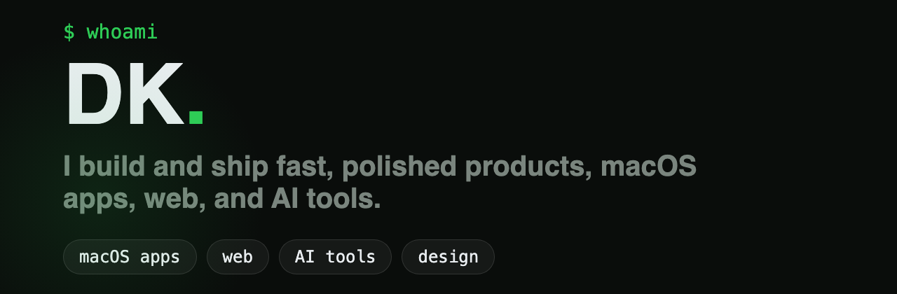

<p align="center">
  
</p>

<p align="center">
  <a href="https://www.ismynamedk.in/"></a>
  <a href="https://github.com/ismynamedk/nod"></a>
  <a href="https://www.instagram.com/vibecodewithdeeekayyyy/"></a>
  <a href="mailto:ismynamedk@gmail.com"></a>
</p>

---

Independent builder. I design, build, and ship real products end to end, web apps,
mobile apps, AI tools, e-commerce, hardware, and the automations behind them. Fast,
polished, and made to feel good to use.

### Currently launching

<a href="https://github.com/ismynamedk/nod">
  
</a>

**[Nod](https://github.com/ismynamedk/nod)** — approve Claude Code with a nod. A macOS
companion that brings Claude Code's approval prompts to your notch, so you tap Yes
instead of babysitting the terminal. Free.

```bash
brew tap ismynamedk/nod && brew install --cask nod
```

### Built with

<p>
  
  
  
  
  
  
  
</p>

### On GitHub

<p>
  
  
</p>

---

<p align="center">
  Build videos: <a href="https://www.instagram.com/vibecodewithdeeekayyyy/"><b>Vibe Code With DK</b></a>
  &middot; Portfolio: <a href="https://www.ismynamedk.in/"><b>ismynamedk.in</b></a>
</p>
